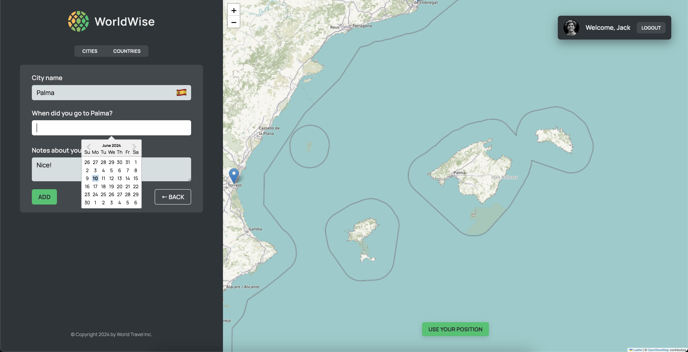

# React + TypeScript + Vite

1. In package.json add in scripts: "server": "json-server --watch data/cities.json --port 9000"
2. Start json server from terminal: npm run server
3. Start app: npm run dev

# Visited Locations App

This is a React application built with Vite that allows users to add locations on a map, specify the date they visited, and view a list of their visited locations and countries. The app uses JSON server to store location data, Leaflet for the map, Styled-Components for styling, and TypeScript.

This is a React application built with Vite that allows users to add locations on a map, specify the date they visited, and view a list of their visited locations and countries. The app uses JSON server to store location data, Leaflet for the map, Styled-Components for styling, and TypeScript. State management is handled using `useReducer`.

## Table of Contents

-   [Features](#features)
-   [Installation](#installation)
-   [Usage](#usage)

## Features

-   Add locations on a map with visit dates
-   View a list of visited locations and countries
-   Uses Leaflet for map functionality
-   Stores data in a JSON server
-   Styled with Styled-Components
-   Written in TypeScript

## Installation

1. Clone the repository:
    ```bash
    git clone https://github.com/yourusername/visited-locations-app.git
    ```
2. Navigate to the project directory:
    ```bash
    cd visited-locations-app
    ```
3. Install the dependencies:
    ```bash
    npm install
    ```

## Usage

1. Start the JSON server:

    ```bash
    npm run server
    ```

    This will start the JSON server and watch the `src/data/locations.json` file on port 9000.

2. Start the development server:
    ```bash
    npm run dev
    ```
    Open your browser and go to `http://localhost:5173` to see the app in action.



